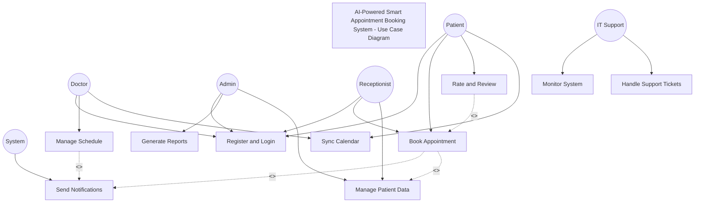

```mermaid
graph TD
    title[AI-Powered Smart Appointment Booking System - Use Case Diagram]
    
    %% Actors
    Patient((Patient))
    Doctor((Doctor))
    Admin((Admin))
    Receptionist((Receptionist))
    ITSupport((IT Support))
    System((System))

    %% Use Cases
    UC1[Register and Login]
    UC2[Book Appointment]
    UC3[Manage Schedule]
    UC4[Send Notifications]
    UC5[Generate Reports]
    UC6[Manage Patient Data]
    UC7[Sync Calendar]
    UC8[Rate and Review]
    UC9[Monitor System]
    UC10[Handle Support Tickets]

    %% Relationships
    Patient --> UC1
    Patient --> UC2
    Patient --> UC8
    Patient --> UC7

    Doctor --> UC1
    Doctor --> UC3
    Doctor --> UC7

    Admin --> UC1
    Admin --> UC5
    Admin --> UC6

    Receptionist --> UC1
    Receptionist --> UC2
    Receptionist --> UC6

    ITSupport --> UC9
    ITSupport --> UC10

    System --> UC4

    %% Include relationships
    UC2 -.-> |<<include>>| UC4
    UC3 -.-> |<<include>>| UC4
    UC2 -.-> |<<include>>| UC6

    %% Extend relationships
    UC8 -.-> |<<extend>>| UC2
```
